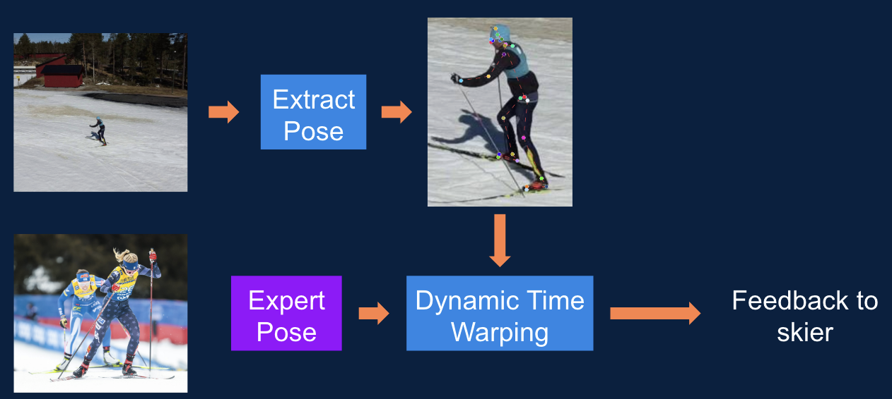

# AI and skiing (Machine Learning-Enhanced Ski Trainer Based on Expert Movement Analysis) 

## Table of Contents
- [Project Description](#project-description)
- [Dataset](#dataset)
- [Keypoint annotations](#keypoint-annotations)
- [Installation](#installation)
- [Usage](#usage)
- [Contribution](#contribution)

## Project Description (Britta)
**TODO**

Our goal is to provide **technique feedback for cross-country skiers** using machine learning. While previous research has primarily focused on **classifying sub-techniques**, little work has been done on **providing (real-time) feedback** based on movement patterns. Most studies have relied on **sensor-based classification** ([[1]](#1), [[3]](#3), [[4]](#4)), while video-based classification has been limited to **controlled treadmill environments**—where sensors have shown better performance ([[2]](#2)).

In this project, we aim to **classify cross-country skiing sub-techniques using non-static drone video data** and **provide feedback to skiers** based on their movement.


*Project overview*

**Scope of the Project**</br>
Cross-country skiing consists of two main styles: **classic** and **skating**. This project focuses on the **skating style**, specifically **gear two and gear three**, as these sub-techniques are available in our dataset.

As part of the project we want to:

1. **Annotate** selected videos.
2. **Finetune a pose estimation model** to detect joint key points automatically.
3. **Use these key points to classify** skating sub-techniques (gear two & three) and their cycle phases.
4. **Apply Long Short-Term Memory (LSTM) networks** for classification, as they have been effective in previous studies ([[1]](#1), [[2]](#2), [[4]](#4)). We also want to test a simple **MLP network**. 
5. **Use Dynamic Time Warping (DTW)** to compare user movement against expert data, generating technique feedback.

By leveraging machine learning and pose estimation, this project aims to enhance technique analysis in cross-country skiing, providing athletes with meaningful, data-driven feedback.

TODO put Halpe dataset here as well?!

## Dataset
**TODO** need to modify this text when we get the new data => add number of videos etc
currently: 26 videos (8 front, 16 side)

The dataset that will be used for this project is drone captured videos of an expert skier skating on flat ground. The skating techniques used in the videos consist mainly of gear two and three. The skier is captured from several different viewpoints but the two we will use are from the front and from the sides based on an interview with a ski coach. Videos in different conditions (e.g. snow, darkness, etc.) and with various levels of skiers might be added later in the project.  

## Keypoint annotations
**TODO**
Talk about annotated data?!
Talk about Halpe dataset?!
We have chosen AlphaPose as the pose estimation model. This is using the [Halpe](https://github.com/Fang-Haoshu/Halpe-FullBody) 26 keypoints: 
```
    //26 body keypoints
    {0,  "Nose"},
    {1,  "LEye"},
    {2,  "REye"},
    {3,  "LEar"},
    {4,  "REar"},
    {5,  "LShoulder"},
    {6,  "RShoulder"},
    {7,  "LElbow"},
    {8,  "RElbow"},
    {9,  "LWrist"},
    {10, "RWrist"},
    {11, "LHip"},
    {12, "RHip"},
    {13, "LKnee"},
    {14, "Rknee"},
    {15, "LAnkle"},
    {16, "RAnkle"},
    {17,  "Head"},
    {18,  "Neck"},
    {19,  "Hip"},
    {20, "LBigToe"},
    {21, "RBigToe"},
    {22, "LSmallToe"},
    {23, "RSmallToe"},
    {24, "LHeel"},
    {25, "RHeel"}
```
We have 


## Installation (Emil)
TODO how to install AlphaPose and how to use it
### AlphaPose Installation
Follow installation from:
https://github.com/MVIG-SJTU/AlphaPose/blob/master/docs/INSTALL.md

Start with conda commands but switch to pip.

1. Create and activate conda enviroment
<br>```conda create -n alphapose python=3.7 -y```
<br>```conda activate alphapose```
2. Install pytroch version 11.3
<br> ```pip3 install torch torchvision --extra-index-url https://download.pytorch.org/whl/cu113```
3. Clone AlphaPose github and change to current working directory
<br>```git clone https://github.com/MVIG-SJTU/AlphaPose.git```
<br>```cd AlphaPose```
4. Install cython
<br>```pip install cython```
5. Run the setup python file
<br>```python setup.py build develop --user ```

To use pretrained Halpe26 model download from the [Model Zoo](https://github.com/MVIG-SJTU/AlphaPose/blob/master/docs/MODEL_ZOO.md) and put the halpe26_fat_res50_256x192.pth file into the pretrained_models folder:

    .
    ├── ...
    ├── pretrained_models
    │   └── halpe26_fat_res50_256x192.pth
    └── ...

#### TODO
#### AlphaPose Finetuning setup

The train.py file did not run for us without fixing some errors first, to make it run we had to:
1. Change the number of workers, we manually edited the DataLoaders in train.py to ``num_workers = 0```
2. Disable the validation set, # TODO
### AlphaPose Usage 

#### Inference
For inference with the alphapose folder as active directory use (example command):
<br>```python scripts/demo_inference.py --cfg configs/halpe_26/resnet/256x192_res50_lr1e-3_1x.yaml --checkpoint pretrained_models/halpe26_fast_res50_256x192.pth --video E:\alphapose\AlphaPose\examples\demo\DJI_0002.MP4 --save_video --vis_fast```

And the output will be in:

    .
    ├── ...
    ├── examples
    │   └── res
    │       ├── alphapose-results.json # Json with keypoints
    │       └── AlphaPose_DJI_0002.mp4 # Video
    └── ...

Then just convert the output format to coco using getAnnotationsFromAlphaPose.ipynb

#### Finetuning

1. Convert videos to images. Put videos for finetuning into a folder and create output folder for split_video_to_jpg.ipynb to split the videos into images. Set video_folder path to the input folder and output_frame_path to output folder in split_video_to_jpg.ipynb. 

2. Put json from cvat into a folder to load from and the same as the video id for example "02.json". Set annotation_folder to the path to this folder in split_video_to_jpg.ipynb and optionally change combined_json_path for output file. 

3. Put split images and annotation file into a training folder to load from. From the [AlphaPose install.md](https://github.com/MVIG-SJTU/AlphaPose/blob/master/docs/INSTALL.md) the file structure is:
```
    .
    ├── json
    ├── exp
    ├── alphapose
    ├── configs
    ├── test
    ├── data
    └── ├── halpe
        └── ├── annotations
            │   ├── halpe_train_v1.json
            │   └── halpe_val_v1.json
            ├── images
            └── ├── train2015
                │   ├── HICO_train2015_00000001.jpg
                │   ├── HICO_train2015_00000002.jpg
                │   ├── HICO_train2015_00000003.jpg
                │   ├── ... 
                └── val2017
                    ├── 000000000139.jpg
                    ├── 000000000285.jpg
                    ├── 000000000632.jpg
                    ├── ...
```
So now put the images and json into this structure or change it in the .yaml in upcomming steps. We do not use the validation set so that folder and json is not needed.

5. Open and edit config in:
```
    .
    ├── json
    ├── exp
    ├── alphapose
    ├── configs
    │   ├── ...
    │   └── halpe_26
    │       └── resnet
    │           ├── 256x192_res50_lr1e-3_1x.yaml # This one 
    │           └── ...
    ├── ...
```
Here you set the train image load folder, annotation file, and set which pretrained weights to use. To use pretrained weights set:
```PRETRAINED: 'pretrained_models/halpe_26_fast_res50_256x192.pth'``` Also change other configs here such as learning rate, epochs, etc. 

6. Run training command:
```python scripts/train.py --exp-id trained_models --cfg configs/halpe_26/resnet/256x192_res50_lr1e-3_1x.yaml```
```--exp_id``` sets the output folder and the trained weights can be found in /exp, for example:

```
    .
    ├── ...
    ├── exp
        └── trained_models-256x192_res50_lr1e-3_1x.yaml
            ├──
    ├── ...
```

7. Run inference with new trained weights, put the trained weights into /pretrained_models folder and in the inference command change ```--checkpoint``` to the weight file name, for example

```python scripts/demo_inference.py --cfg configs/halpe_26/resnet/256x192_res50_lr1e-3_1x.yaml --checkpoint pretrained_models/final_DPG_iter_2.pth --video E:\alphapose\AlphaPose\examples\demo\DJI_0015.MP4 --save_video --vis_fast```

### Testing

```python scripts/test.py --cfg configs/256x192_res50_lr1e-3_1x.yaml --checkpoint pretrained_models/RegLoss100EpochNoFlipDPG.pth --num_workers 4```

## Usage
TODO folder structure, where to find what and how to use it

### Classification
    .
    ├── cycle_splits                # Files to split video into cycles and plot these
    │   ├── labeled data            # Cycles labeled with corresponding gear
    │   ├── lable_cycles.ipynb      # Script to split video into cycles and label these
    ├── training                    # Scripts for Training a classification model (MLP, LSTM)

This folder contains files that can be used to split a video of a crosscountry skier into cycles. 

#### Label Cycles (Britta)

With the file `lable_cycles.ipynb` a video of a crosscountry skier can be split into cycles and the cycles can be labeled with the corresponding gear. To do so the video and the keypoint annotations are needed. The keypoint annotations need to follow the COCO format and therefore contain the following section:

```
{
    "info": {...},
    "licenses": [...],
    "images": [...],
    "annotations": [...],
    "categories": [...]
}
```
We are using the following keypoints: `["Nose","LEye","REye","LEar","REar","LShoulder","RShoulder","LElbow","RElbow","LWrist","RWrist","LHip","RHip","LKnee","RKnee","LAnkle","RAnkle","Head","Neck","Hip","LBigToe","RBigToe","LSmallToe","RSmallToe","LHeel","RHeel"]`

Under Config you can modify the following parameters:
|Param  | Description   |
|------ |---------------|
|CHOOSEN_JOINT | With this parameter we can set a single joint that we want to use for detecting a cycle. It is only possible to set one joint for this. |
|CHOOSEN_REF| Sets a reference joint to compute relative movements of other joints. By doing so we can better compare the cycles. We have used the Hip as a reference joint. |
|CHOOSEN_DIM| Determines the dimension (x or y) to be used for cycle detection. |
|sigma_value| Defines the smoothing factor for the signals. We are using Gaussian smoothing. |
|order| Sets the minimum spacing between detected local minima in the X and Y movement data, filtering out minor fluctuations. (Is this right??) |
|LABELS| This parameter contains a dictionary with possible labels and keys that can be used as some kind of shortcut for labeling (more details further down). If more gears should be added, this has to be done here. |
|CHOOSEN_KEYPOINTS| Sets the joints that should be saved for each cycle. Both x and y value will be saved to a json file by default for each joint.|
|VIDEO_DIR| Path to directory where the video files are stored. |
|ANNO_DIR| Path to the directory where the corresponding annotations in COCO format are stored. |
|video_id| ID of video which should be labeled. |

When running the Jupyter notebook a new window will be opened where your selected video is being played. It will pause after the first cycle. You can then enter the following options: 
- "2" : Gear 2
- "3" : Gear 3
- "4" : Gear 4
- "u" : Unknown (Transition or if no gear can be identified)
- "r" : Replay the cycle
- "q" : Quit the program

As **output** a json file will be saved in your working directory. The json file will have the following structure:
```
{
    "Cycle 1" : {
        "RAnkle_x" : [...],
        "RAnkle_y : [...],
        "Label": "gear2",
        "Start_frame": 34,
        "End_frame": 100
    },
    "Cycle 2" : {
        "RAnkle_x" : [...],
        "RAnkle_y : [...],
        "Label": "gear3",
        "Start_frame": 100,
        "End_frame": 173
    },
    ...
}
```
Each Cycle contains the keypoints for the choosen joints in that time period, a label and the start and end frame. 

#### Training (Emil)

The ```/training``` folder contains two main runnable files for optimizing and training MLP or LSTM models for gear classification of the cycles. The file ```train.py``` loads parameters from ```config.yaml``` and does cross validation with each fold getting the average from the seeds listed in config, on the ```train.json``` dataset. In ```/run``` it outputs plots of the averaged metrics in ```/plots```, each model from each seed in each fold in ```/saved_models```, and the tensorboard logs in ```/tensorboard_runs```. 

Parameters in ```config.yaml```:

**DATASET**
| Param            | Description |
|-----------------|-------------|
| TRAIN_SIZE | Proportion of the dataset used for training in hyperparameter optimization. |
| VAL_SIZE | Proportion of the dataset used for validation in hyperparameter optimization. |
| ROOT_PATH | Relative path to the dataset. |
| ROOT_ABSOLUTE_PATH | Absolute path to the dataset for reference. Used in hyperparameter optimization because raytune have different root.  |
| FILE_PREFIX | Prefix for labeled cycle files in the dataset. |
| AUG: SMOOTHING | Smoothing factor applied to the dataset. |
| AUG: NORMALIZATION | Determines if dataset normalization should be applied. |
| AUG: NORM_TYPE | Type of normalization applied to the dataset `full_signal` or `per_timestamp`. |

**DATA_PRESET**
| Param            | Description |
|-----------------|-------------|
| CHOOSEN_JOINTS | List of selected joints used for classification. |
| LABELS | Dictionary mapping cycle labels to numeric values. |

**TRAIN**
| Param            | Description |
|-----------------|-------------|
| BATCH_SIZE | Number of samples per batch during training. |
| EPOCHS | Total number of training epochs. |
| OPTIMIZER | Optimization algorithm used. |
| LOSS | Loss function used `cross_entropy` or `focal_loss`. |
| LR | Learning rate for the optimizer. |
| PATIENCE | Number of epochs with no improvement before early stopping. |
| K_FOLDS | Number of folds used for k-fold cross-validation. |
| SEEDS | List of random seeds for reproducibility. The first seed in this list is used for the cross validation split and seed in train/val split for hyperparemeter optimization.  |

**NETWORK**
| Param            | Description |
|-----------------|-------------|
| NETWORKTYPE | Specifies the neural network architecture `lstm` or `mlp`. |
| LSTM: HIDDEN_SIZE | Number of hidden units in the LSTM network. |
| LSTM: NUM_LAYERS | Number of stacked LSTM layers. |
| LSTM: DROPOUT | Dropout rate applied to the LSTM layers. |
| MLP: HIDDEN_1 | Number of neurons in the first hidden layer of MLP. |
| MLP: HIDDEN_2 | Number of neurons in the second hidden layer of MLP. |

**LOGGING**
| Param            | Description |
|-----------------|-------------|
| ROOT_PATH | Root path for all the outputs. |
| TENSORBOARD_PATH | Path for TensorBoard logs within `ROOT_PATH`. |
| MODEL_DIR | Path for saved models within `ROOT_PATH`. |
| PLOT_PATH | Path for plots within `ROOT_PATH`. |

### OPTIMIZATION
| Param            | Description |
|-----------------|-------------|
| SEARCH_CONFIG | .yaml file defining the hyperparameter search space. |
| OUTPUT_ROOT | Root directory for saving training outputs and checkpoints. |
| CHECKPOINTS: ENABLE | Enables checkpointing during training `true` or `false`. |


The file ```tune_hyperparameters.py``` load a search space parameters from ```search_space.yaml``` and other run parameters from ```config.yaml``` and use raytune to optimize models and output the best found paramateres in ```/ray_tune```. 

#### Create Annotations (Emil)

#### Other models (Britta)
(write about Installation of MMPose?)

We have tested the following pose estimation models for this projects (TODO):

||**MediaPipe**|**YoloNas**|**MMPose**|**OpenPose**|**AlphaPose (chosen)**|
|-|------------|-----------|----------|------------|-------------|
|**Images detection**|11 sec|6 min|37 sec|||
|**Video detection**|2 min?|Over 1 h|6 min|88 sec|44 sec|
|**Issues**|Keypoint annotations were very bad|Good annotations but very slow|Very good annotations but feet are not detected|Feet are annotated, but annotations were quite jumpy|Annotations are less accurate than with MMPose but still very good and feet are also annotated|

**Criteria for choosing the pose estimation model:**
- Accuracy of keypoint annotations
- Duration for detection
- Predicted keypoints (We wanted to include all main joints of the body. After meeting with a crosscountry ski trainer we looked for a model that also includes keypoints on the foot.)


## Contribution
TODO not sure if we even need this  

## TODO
- [ ] Feedback system


## References
<a id="1">[1]</a> 
Gupta, S. S., Johansson, M., Kuylenstierna, D., Larsson, D., Ortheden, J., & Pettersson, M. (2022). Machine learning techniques for GAIT analysis in skiing. In Advances in intelligent systems and computing (pp. 126–129). https://doi.org/10.1007/978-3-030-99333-7_21 

<a id="2">[2]</a> 
Nordmo, TA.S., Riegler, M.A., Johansen, H.D., Johansen, D. (2023). Arctic HARE: A Machine Learning-Based System for Performance Analysis of Cross-Country Skiers. In: Dang-Nguyen, DT., et al. MultiMedia Modeling. MMM 2023. Lecture Notes in Computer Science, vol 13833. Springer, Cham. https://doi.org/10.1007/978-3-031-27077-2_43 

<a id="3">[3]</a> 
Pousibet-Garrido, A., Polo-Rodríguez, A., Moreno-Pérez, J. A., Ruiz-García, I., Escobedo, P., López-Ruiz, N., Marcen-Cinca, N., Medina-Quero, J., & Carvajal, M. Á. (2024). Gear Classification in Skating Cross-Country Skiing Using Inertial Sensors and Deep Learning. Sensors, 24(19), 6422. https://doi.org/10.3390/s24196422 

<a id="4">[4]</a> 
Rassem, A., El-Beltagy, M., & Saleh, M. (2017). Cross-Country Skiing Gears Classification using Deep Learning. arXiv:1706.08924. https://doi.org/10.48550/arXiv.1706.08924 

<a id="5">[5]</a> 
Wang, J., Qiu, K., Peng, H., Fu, J., & Zhu, J. (2019). AI Coach: Deep human pose estimation and analysis for personalized athletic training assistance. Proceedings of the 30th ACM International Conference on Multimedia. https://doi.org/10.1145/3343031.3350910 

<a id="6">[6]</a> 
Yue, C. Z., Yong, L. C., & Shyan, L. N. (2022). Exercise quality analysis using AI model and computer vision. Journal of Engineering Science and Technology Special Issue (pp. 157 - 171). https://jestec.taylors.edu.my/Special%20Issue%20SIET2022/SIET2022_10.pdf 

